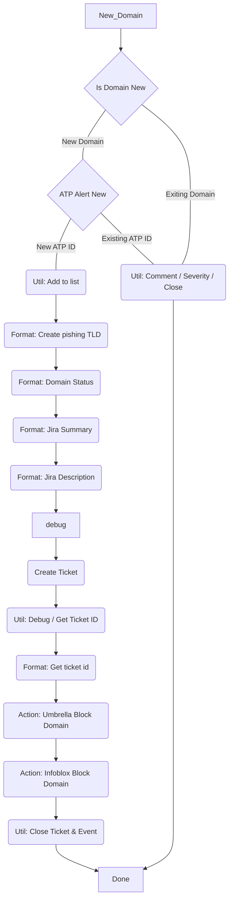

```mermaid
graph TD;
    New_Domain-->NeworExitsting{Is Domain New};
    
    NeworExitsting-- New Domain ---ATPNew{ATP Alert New};
    NeworExitsting-- Exiting Domain ---AddClost(Util: Comment / Severity / Close);

    ATPNew-- New ATP ID ---AlertN(Util: Add to list);

    AlertN --> PTLD(Format: Create pishing TLD);
    ATPNew-- Existing ATP ID ---AddClost;

    PTLD --> ds(Format: Domain Status);
    ds --> js(Format: Jira Summary);
    js --> jd(Format: Jira Description);

    jd --> debug;

    debug --> createTicket(Create Ticket);
    createTicket --> debugTicket(Util: Debug / Get Ticket ID);

    debugTicket --> getTicketInfo(Format: Get ticket id);

    getTicketInfo --> umbBlock(Action: Umbrella Block Domain);
    umbBlock --> ibBlock(Action: Infoblox Block Domain);

    ibBlock --> closeTicket(Util: Close Ticket & Event);
    
    closeTicket --> Done;
    AddClost --> Done;
```
